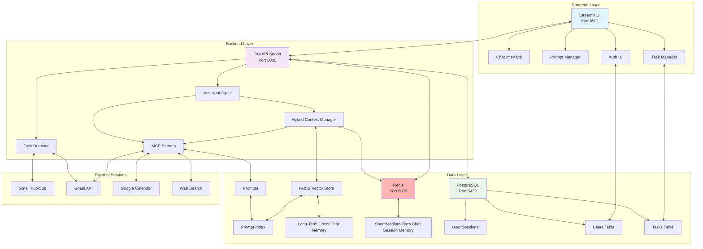
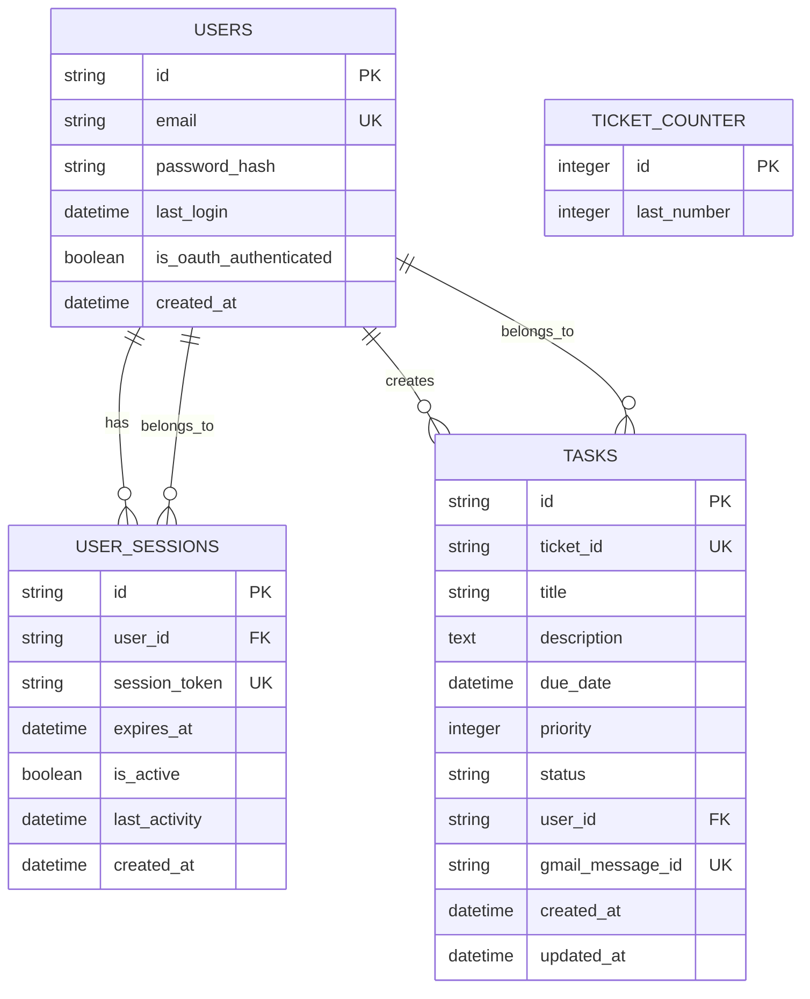
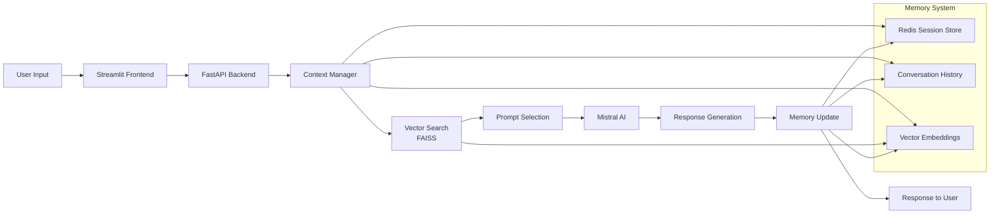
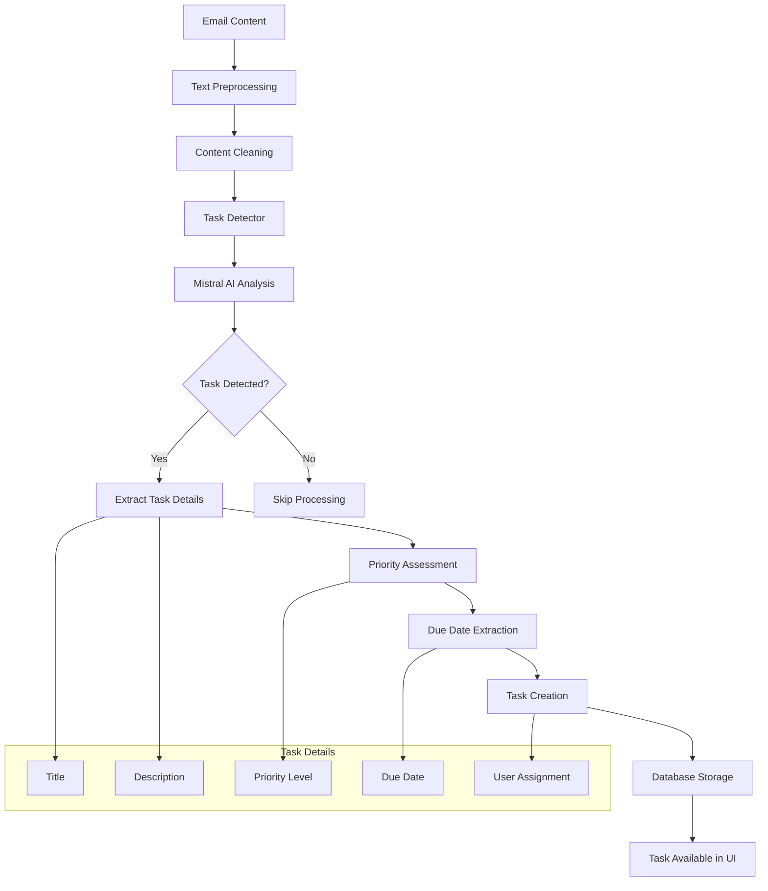
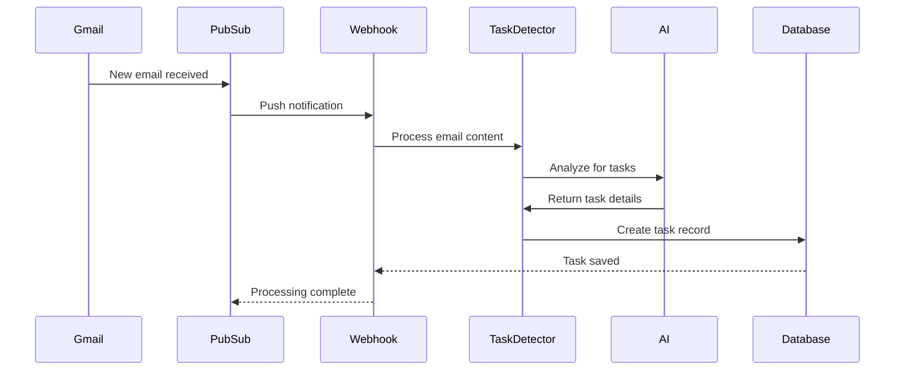
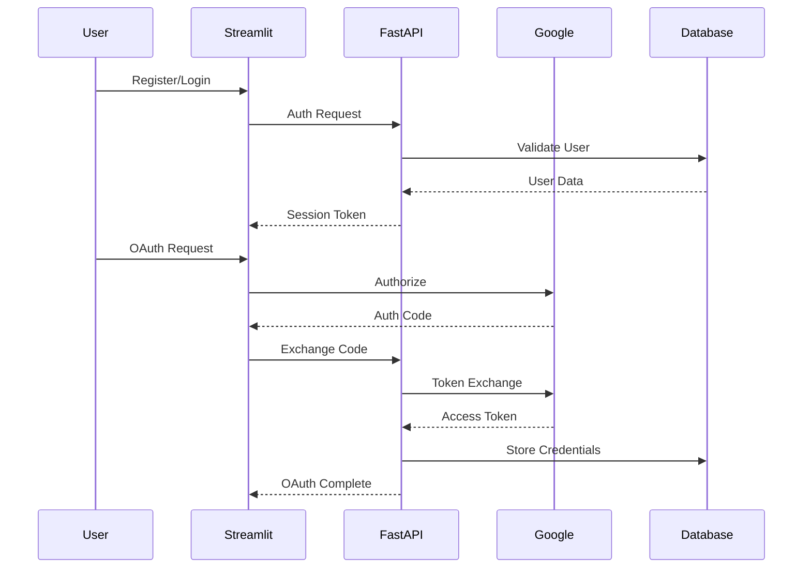
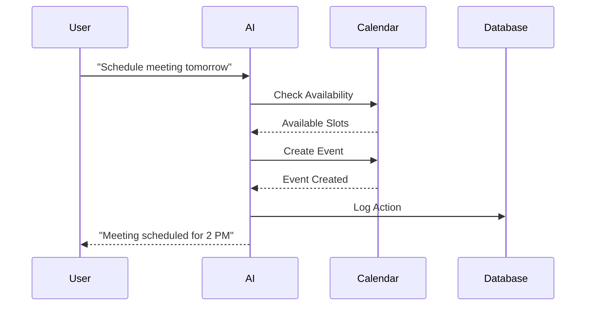

# Assistant to the Regional Manager

A sophisticated AI-powered assistant that integrates with Gmail to automatically detect, create, and manage tasks from emails. Built with FastAPI, Streamlit, and powered by Mistral AI.

## 🌟 Features

### Core Functionality
- **Gmail Integration**: Automatic email monitoring and task extraction based on Gmail Pub/Sub triggers
- **AI-Powered Task Detection**: Uses Mistral AI to intelligently identify tasks from emails
- **Task Management**: Full CRUD operations for tasks with priority and due date support
- **Real-time Chat Interface**: Interactive chatbot with conversation history
- **OAuth Authentication**: Secure Google OAuth integration for Gmail access
- **Multi-session Support**: Manage multiple chat sessions with persistent history

### Advanced Features
- **Smart Prompt Management**: Dynamic prompt selection based on conversation context
- **Vector-based Memory**: FAISS-powered semantic search for conversation history
- **Calendar Integration**: Schedule and manage calendar events
- **Web Search Capabilities**: Real-time web search for current information
- **Database Persistence**: PostgreSQL with Alembic migrations
- **Redis Caching**: High-performance session and data caching


## 🏗️ Architecture

### System Overview


### Backend (FastAPI)
- **API Layer**: RESTful endpoints for chat, tasks, authentication, and OAuth
- **Agent System**: Modular AI agents with specialized tools and prompts
- **Database Layer**: SQLAlchemy ORM with PostgreSQL
- **Memory Management**: Redis-based session storage and vector search
- **Task Detection**: AI-powered email analysis and task extraction

### Frontend (Streamlit)
- **Chat Interface**: Real-time messaging with the AI assistant
- **Task Manager**: Visual task management with filtering and sorting
- **Authentication UI**: User registration, login, and OAuth flow
- **Prompt Manager**: Dynamic prompt editing and management
- **Session Management**: Multi-session chat history

### Infrastructure
- **Docker Compose**: Complete containerized development environment
- **PostgreSQL**: Primary database for users, tasks, and sessions
- **Redis**: Caching and session storage
- **Alembic**: Database migration management

## 🚀 Quick Start

### Prerequisites
- Docker and Docker Compose
- Python 3.12+
- Google Cloud Project (for Gmail API)

### 1. Clone the Repository
```bash
git clone <repository-url>
cd AssistantToTheRegionalManager
```

### 2. Environment Setup
Create a `.env` file in the root directory:
```env
# Mistral AI Configuration
MISTRAL_KEY=your_mistral_api_key

# API Configuration
FASTAPI_URI=http://fastapi:8000
REDIRECT_URI=http://localhost:8000/oauth2callback

# Google OAuth Configuration
GOOGLE_CLIENT_SECRET_JSON=google_setup/client_secret.json
GOOGLE_PROJECT_ID=your_project_id
GOOGLE_TOPIC=your_pubsub_topic

# Database Configuration (optional - defaults are used)
POSTGRES_USER=postgres
POSTGRES_PASSWORD=postgres
POSTGRES_HOST=localhost
POSTGRES_PORT=5432
POSTGRES_DB=taskmanager

# Redis Configuration (optional - defaults are used)
REDIS_URL=redis://localhost:6379

# Optional Configuration
MCP_SERVER_PATH=backend/assistant_app/mcp_server.py
ENVIRONMENT=development
```

### 3. Start the Application
```bash
# Start all services
docker-compose up -d

# Or start with logs
docker-compose up
```

### 4. Access the Application
- **Streamlit UI**: http://localhost:8501
- **FastAPI Docs**: http://localhost:8000/docs
- **PostgreSQL Database**: localhost:5432
- **Redis**: localhost:6379

## 📋 Setup Instructions

### Google OAuth Setup
1. Go to [Google Cloud Console](https://console.cloud.google.com/)
2. Create a new project or select existing one
3. Enable Gmail API and Google+ API
4. Create OAuth 2.0 credentials
5. Download the client secret JSON file
6. Place the JSON file in the `google_setup/` directory as `client_secret.json`
7. Add authorized redirect URIs:
   - `http://localhost:8000/oauth2callback`
   - `http://localhost:8501/oauth2callback`
8. Copy your Project ID to the `GOOGLE_PROJECT_ID` variable in your `.env` file
9. Create a Pub/Sub topic for Gmail notifications and add it to `GOOGLE_TOPIC` in your `.env` file

### Database Setup
```bash
# Run database migrations
docker-compose exec fastapi alembic upgrade head
```

### First Time Setup
1. Access the Streamlit UI at http://localhost:8501
2. Register a new account
3. Login and authenticate with Google
4. Grant Gmail permissions
5. Start chatting with your AI assistant!

## 🛠️ Development

### Project Structure
```
AssistantToTheRegionalManager2/
├── backend/
│   └── assistant_app/
│       ├── agents/           # AI agents and tools
│       ├── api/             # FastAPI endpoints
│       ├── models/          # Database models
│       ├── services/        # Business logic
│       └── utils/           # Utilities and helpers
├── streamlit/               # Streamlit frontend
├── alembic/                 # Database migrations
├── scripts/                 # Utility scripts
└── docker-compose.yml       # Container orchestration
```

### Running in Development Mode
```bash
# Install dependencies
conda env create -f environment.yml
conda activate env

# Start services
docker-compose up postgres redis -d

# Run FastAPI backend
cd backend
uvicorn assistant_app.main:app --reload --host 0.0.0.0 --port 8000

# Run Streamlit frontend
cd streamlit
streamlit run main.py
```

### Database Migrations
```bash
# Create new migration
docker-compose exec fastapi alembic revision --autogenerate -m "description"

# Apply migrations
docker-compose exec fastapi alembic upgrade head
```

### Database Schema


## 🔧 Configuration

### Environment Variables
| Variable | Description | Default | Required |
|----------|-------------|---------|----------|
| `MISTRAL_KEY` | Mistral AI API Key | - | ✅ Required |
| `FASTAPI_URI` | FastAPI server URI | http://fastapi:8000 | ✅ Required |
| `REDIRECT_URI` | OAuth redirect URI | http://localhost:8000/oauth2callback | ✅ Required |
| `GOOGLE_CLIENT_SECRET_JSON` | Path to Google client secret JSON file | google_setup/client_secret.json | ✅ Required |
| `GOOGLE_PROJECT_ID` | Google Cloud Project ID | - | ✅ Required |
| `GOOGLE_TOPIC` | Google Pub/Sub topic for Gmail notifications | - | ✅ Required |
| `POSTGRES_USER` | PostgreSQL username | postgres | ❌ Optional |
| `POSTGRES_PASSWORD` | PostgreSQL password | postgres | ❌ Optional |
| `POSTGRES_HOST` | PostgreSQL host | localhost | ❌ Optional |
| `POSTGRES_PORT` | PostgreSQL port | 5432 | ❌ Optional |
| `POSTGRES_DB` | PostgreSQL database name | taskmanager | ❌ Optional |
| `REDIS_URL` | Redis connection URL | redis://localhost:6379 | ❌ Optional |
| `MCP_SERVER_PATH` | Path to MCP server script | backend/assistant_app/mcp_server.py | ❌ Optional |
| `ENVIRONMENT` | Application environment | development | ❌ Optional |

### Docker Configuration
The application uses Docker Compose with the following services:
- **postgres**: PostgreSQL database
- **redis**: Redis cache and session storage
- **fastapi**: Backend API server
- **streamlit**: Frontend web interface

## 📚 API Documentation

### Core Endpoints
- `POST /chat` - Chat with AI assistant
- `GET /tasks` - Get user tasks
- `POST /tasks` - Create new task
- `GET /oauth2callback` - OAuth callback handler
- `POST /gmail/push` - Gmail webhook endpoint

### Authentication
- `POST /auth/register` - User registration
- `POST /auth/login` - User login
- `POST /auth/logout` - User logout

## 🤖 AI Features

### Chat Conversation Flow


### Task Detection
The AI automatically detects tasks from Gmail messages using:
- Natural language processing
- Priority assessment
- Due date extraction
- Context understanding

### Task Detection Pipeline


### Conversation Memory
- Vector-based semantic search
- Context-aware responses
- Persistent conversation history
- Multi-session management

### Tools and Integrations
- **Calendar Tools**: Schedule and manage events
- **Gmail Tools**: Email composition and management
- **Web Search**: Real-time information retrieval
- **Task Management**: CRUD operations for tasks

## 🔄 Workflows

### 📧 Gmail Integration Workflow



### 🔐 Authentication Flow



### 📅 Calendar Integration Flow



## 🔒 Security

- **OAuth 2.0**: Secure Google authentication
- **Password Hashing**: bcrypt for user passwords
- **Session Management**: Secure session tokens
- **CORS Protection**: Configured for production use
- **Input Validation**: Pydantic models for data validation

## 📊 Monitoring and Logging

- **Health Checks**: Docker health checks for all services
- **Logging**: Structured logging with different levels
- **Error Handling**: Comprehensive error handling and recovery
- **Database Monitoring**: Connection pool management

## 🚀 Deployment

### Production Considerations
1. **Environment Variables**: Use production secrets
2. **Database**: Use managed PostgreSQL service
3. **Redis**: Use managed Redis service
4. **SSL/TLS**: Configure HTTPS
5. **CORS**: Restrict origins to your domain
6. **Rate Limiting**: Implement API rate limiting
7. **Monitoring**: Add application monitoring

---